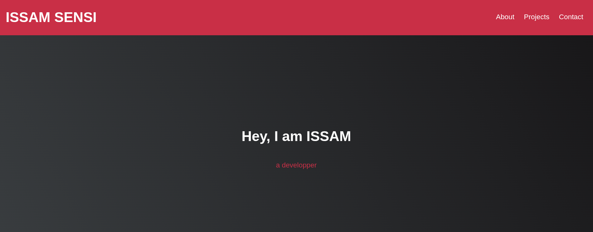
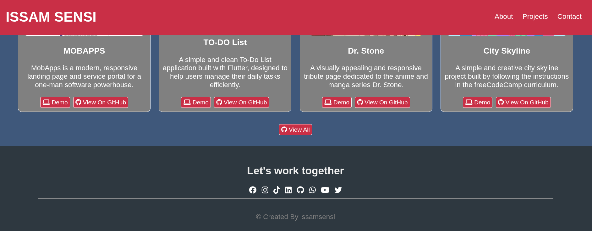

# ISSAM SENSI Portfolio v1

A modern, responsive portfolio website to showcase the projects and skills of ISSAM SENSI. This site highlights web, mobile, and creative coding projects, and provides easy ways to connect and collaborate.

## 🌐 Live Demo
[View Demo](https://issamsensi.github.io/mobapps/portfolio-v1/)

## 📸 Screenshots




## ✨ Features
- Clean, responsive design
- Project gallery with live demos and GitHub links
- Social/contact section for easy networking
- Built with only HTML5, CSS3, and Font Awesome icons

## 🛠️ Technologies Used
- HTML5
- CSS3
- Font Awesome (for icons)

## 📦 Project Structure
```
portfolio-v1/
  index.html      # Main HTML file
  styles.css      # Custom styles for the site
  screens/        # Screenshots for README
```

## 🚀 How to Use
1. **Clone the repository**
   ```zsh
   git clone https://github.com/issamsensi/portfolio-v1.git
   cd portfolio-v1
   ```
2. **Open `index.html` in your browser**
3. Explore the projects and connect!

## 📬 Contact & Socials
- [Facebook](https://facebook.com/issamsensi)
- [Instagram](https://instagram.com/issamsensi)
- [TikTok](https://www.tiktok.com/@issamsensi)
- [LinkedIn](https://www.linkedin.com/in/issam-amghar-406b3a228)
- [GitHub](https://github.com/issamsensi)
- [WhatsApp](https://wa.me/+212658987985)
- [YouTube](https://youtube.com/@issamsensi?si=4ZpR37-s4ifInfwj)
- [Twitter/X](https://x.com/issamsensi)

## 👤 Author
**ISSAM SENSI**

---
© 2025 [issamsensi](https://github.com/issamsensi)
